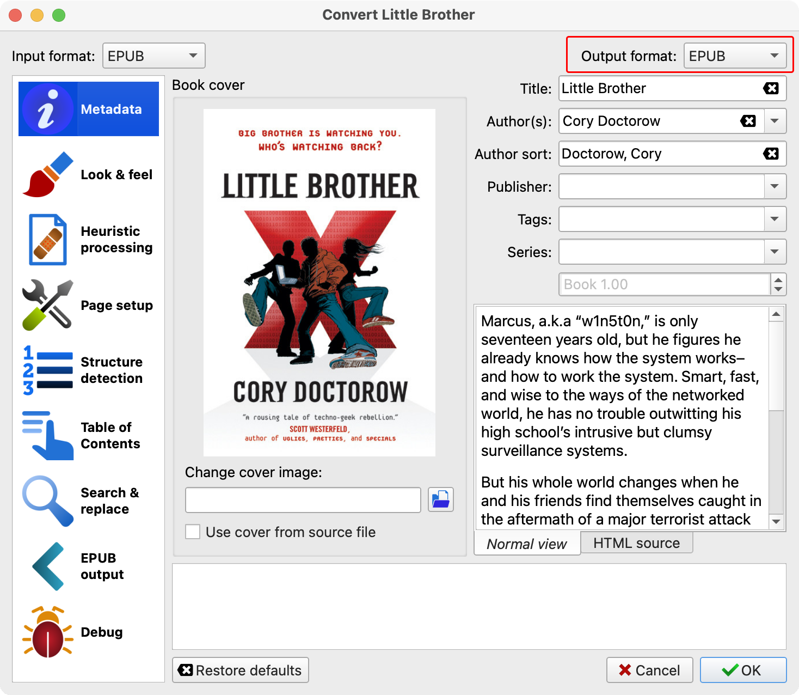
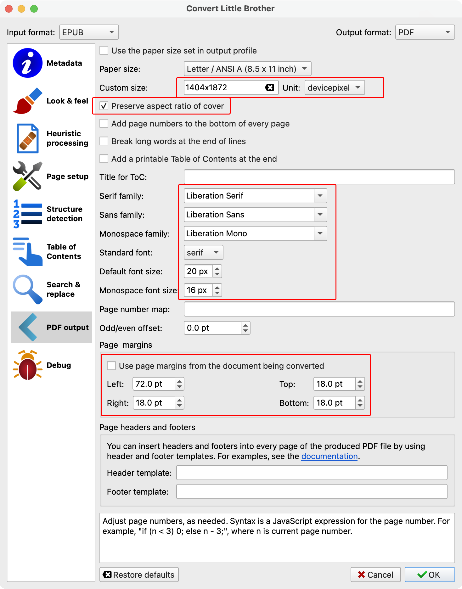
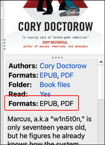
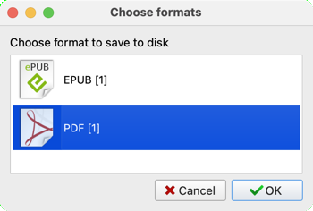

# Calibre

[Calibre](https://calibre-ebook.com/) is a free, open-source program for working with ebook files. This includes ...

* A "library", where you can store and organize your ebook files.

* An ebook reader, where you can read your ebooks on the computer.

* An ebook *editor* for EPUB and AZW3 (Kindle) files. This allows you to edit the HTML and CSS files *within* the EPUB/AZW3 files, and see a live preview of your changes while you're making them.

* A metadata editor, where you can set and change a book's title, author, cover image, descriptions, ISBN numbers, and just about any other kind of metadata the books may have.

* A metadata download tool, which can find cover images, descriptions, ISBN numbers, and other data online, and download them to the ebook file.

* **Converting ebook files between different formats.** For example, if you have a book as an EPUB, Calibre can convert it to PDF.

* Copying ebook files *to*, and in some cases *from*, most "ebook reader" devices.

Calibre also has a plug-in framework which allows third-party developers to add functionality to Calibre. This includes things like support for new ebook readers and support for new file formats.

The [awesome-reMarkable](https://github.com/reHackable/awesome-reMarkable) list has two different Calibre plug-ins for reMarkable tablets.

* [Calibre-Remarkable-Device-Driver-Plugin](https://github.com/naclander/Calibre-Remarkable-Device-Driver-Plugin) works by SSH'ing into the tablet.

    > As of the time I'm writing this (2023-08-03), this plug-in hasn't been updated since April 2022, the Github repo has been "archived", and **the plug-in doesn't work with tablets running firmware 3.x or later.**

* [send_by_rmapi](https://github.com/LisaGlaser/send_by_rmapi) works by using [rmapi](https://github.com/juruen/rmapi) to upload files to the reMarkable cloud, which would then sync the file to your tablet.

## EPUB and PDF files

The reMarkable tablets allow you to upload ebooks in EPUB and PDF formats.

* **PDF files contain pages**. Each page contains instructions like "draw this text in this position" or "draw this picture in this position". In many PDF files, the page contains a single "draw this picture" instruction, and the picture contains all of the text and other content, already laid out as a page-sized BMP, GIF, or JPG file.

* **EPUB files contain text** with formatting instructions. These include things like which words should be **bold** or *italic*, where each paragraph starts and ends, when each chapter starts and ends, and so forth. EPUB file are actually ZIP files containing HTML and CSS files, so when you're reading an EPUB file you're actually looking at a web page.

When you upload an EPUB file to a reMarkable tablet, the tablet converts it to PDF internally. When you "read" the file on the tablet, you are actually reading the PDF.

My *guess* is that reMarkable set it up this way because they wanted to allow users to be able to "write" on top of EPUB files, the same way they can with PDF files.

Most ebook readers allow EPUB files to be re-formatted on the fly. This would be a problem for the reMarkable tablet, because they want to allow the user to add annotations.

* Pen strokes are always stored at the position on the page where they were written.

* Some annotations are made because of where they are *relative to the page*. For example, somebody might write in an empty space at the bottom of a page, because that part of the page happens to be empty.

* Other annotations are made at a position *relative to the text* in the underlying file. For example, if you highlight a sentence, the highlight "belongs with" that particular sentence.

Some annotations are relative to the page, and others are relative to the text. Think about what would happen if the text were re-formatted on the fly. For example, if the font was made larger, the lines of text would "shift down" on each page, and the text at the bottom of a page would be moved to the top of the next page. There's no way for the tablet to "know" which annotations to move with the text, or which piece of text each annotation should be "attached to".

So.

Instead of allowing EPUB files to be re-formatted on the fly, the reMarkable software "locks" the text on each page so it can't be moved. This way, all annotations can be "relative to the page", and also be "relative to the text" at the same time.

Because the tablet already needed to be able to show PDF's, they decided to **convert all EPUBs to PDF** when they're uploaded, and just show the PDF whenever the user wants to work with the file.

### Automatic conversion on the tablet

This conversion process ... has issues. I had two different books where some of the diagrams were *missing* when I read the file on my tablet. And in one of these files, the text was so large that tables of pre-formatted text ended up being "wrapped" on the page and almost unreadable. Being able to make the text smaller (a *little* bit smaller anyway) would have made that particular table a lot easier to read. (Both of the files where this happened are copyrighted, otherwise I would include them here so you can see for yourself what happened.)

The conversion process also doesn't offer you any way to control the font (or font *size*), margins, line spacing, or any of the other things that "real" ebook readers let you adjust on the fly. In fact, it doesn't really tell you *that* it's doing a conversion at all. This may be by design, but I feel like it should at least *tell* the user that the file is being converted, even if it's only in the documentation. (To be fair, this may *be* in the documentation somewhere, but if so, I haven't seen it.)

In order to avoid this, I've started manually converting EPUB files to PDF when I want to upload them to my tablet.

This means I'm able to control the fonts, font size, line spacing, and margins. Also, the EPUB-to-PDF conversion process in Calibre has never left me with diagrams missing, and I can verify the results of the conversion on the computer's screen before uploading the PDF to the tablet.

## Manual Conversion

Start by adding the EPUB (or other ebook) file to Calibre's library. In my case this is easy, because I use Calbre *as* the primary place to store all of my ebooks.

Right-click on the file you want to convert, "Convert books", "Convert individually".

The "Convert (title)" window will appear. This window has a LOT of settings, accessible in pages using the columns on the left, and some pages have tabs across the top.

The important and/or useful settings are:

* At the top right, Output format: **PDF**

* Look &amp; feel

    * Disable font size rescaling: NO
    * Base font size: 20pt

* Page setup

    * Output profile: **Tablet**
    * Input profile: **Default profile**

* PDF output

    * Custom size: `1404x1872` Unit: `devicepixel`
    * Preserve aspect ratio of cover: YES
    * Serif family: (font for text with serifs, such as "Liberation Serif")
    * Sans family: (font for text without serifs, such as "Liberation Sans")
    * Monospace family: (font for mono-spaced text, such as "Liberation Mono")
    * Standard font: which font "family" to use by default (serif/sans/mono)
    * Default font size: 20px
    * Monospace font size: 16px
    * At the bottom, under "Page margins", set the page margins. I normally use `72pt` for whichever edge the menu appears on (i.e. left edge, if the tablet is set for "right handed"), and `18pt` for the others.

    

* Check other pages and make whatever other adjustments you need.

* Click "OK" at the bottom right.

Calibre will start a background job to do the conversion. When it finishes, the information panel (usually on the right, but it can be configured to be on the bottom) will show the original format *and* PDF.

Once the PDF has been created, right-click the file again, and choose "Save to disk" &#x2192 "Save single format to disk..."

Choose PDF as the format, and click "OK".

Save the file where you want it. In my case I normally choose my "Desktop" folder. Calibre creates a directory named after the author, containing a directory named after the book title, which contains the PDF file (and possibly a few other related files, like a copy of the cover art as a JPG file).

Upload the PDF file to your tablet.

### Notes

* [Liberation Fonts](https://github.com/liberationfonts/liberation-fonts/releases) are open-source fonts whose characters are designed to have the exact same metrics (character sizes, spacing, etc.) as "Times New Roman", "Arial", and "Courier New", all of which are copyrighted and cannot legally be distributed in a PDF file. I use them in the PDFs I create, both for legal reasons *and* because I think they look good.

* [Little Brother](https://craphound.com/littlebrother/about/) (the book I used as an example in the screenshots) is copyrighted. The author, [Cory Doctorow](https://craphound.com/bio/), is an even bigger believer in the idea of "open source" than I am, and offers free downloads of the ebook versions of most of his books.
