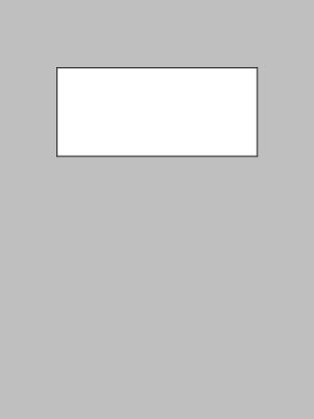

# The `make-cover-template` Script

This shell script uses [ImageMagick](https://imagemagick.org/)'s `magick` command to create a simple `.png` template which can be used as a "cover page" for notebooks in a reMarkable tablet. It looks like this ...



*Hey, I said it was simple ...* &#x1F601;

This is a scaled-down version to show what it looks like. If you *just* want to download the `.png` file and aren't interested in the script which created it, here's a link to download it.

&#x21D2; [`cover.png`](cover.png)

## License

This script, and the `.png` files it creates, are too simple to *worry* about licensing, so...

> 
>
> To the extent possible under law, John Simpson has waived all copyright and related or neighboring rights to this script and/or the image files it produces.
>
> These works are published from the United States of America.

## The Script

You can modify the size and position of the box on the page by changing the values of the following variables:

* `BOX_W` is the width of the box.
* `BOX_H` is the height of the box.
* `BOX_Y` is the vertical position of the top of the box. 0 is the top of the image.

&#x21D2; [Download](make-cover-template)

```bash
#!/bin/bash
#
# make-cover-template
# John Simpson <jms1@jms1.net> 2023-07-04
#
# Create a simple "cover page" template

########################################
# Page dimensions
#
# These values are correct for reMarkable tablets, only change if you're
# making a cover image to fit some other device.

PAGE_W=1404
PAGE_H=1872

########################################
# Background colour. This can be anything ImageMagick recognizes, you can run
# "magick -list color" to see a list of pre-defined colour names.
#
# Examples: (these are all the same colour)
# - "gray75"
# - "#BFBFBF"
# - "srgb(191,191,191)"

PAGE_BG="gray75"

########################################
# Box outer dimensions and Y position.
# - X will be calculated so the box is centered on the page.

BOX_W=900
BOX_H=400

BOX_Y=300

########################################
# Calculate the boxes' corner positions.
# - Each box will be "inside" the one before it.

AX1=$(( ( PAGE_W - BOX_W ) / 2 ))
AY1=$BOX_Y
AX2=$(( AX1 + BOX_W ))
AY2=$(( AY1 + BOX_H ))

BX1=$(( AX1 + 3 ))
BY1=$(( AY1 + 3 ))
BX2=$(( AX2 - 3 ))
BY2=$(( AY2 - 3 ))

CX1=$(( BX1 + 2 ))
CY1=$(( BY1 + 2 ))
CX2=$(( BX2 - 2 ))
CY2=$(( BY2 - 2 ))

DX1=$(( CX1 + 1 ))
DY1=$(( CY1 + 1 ))
DX2=$(( CX2 - 1 ))
DY2=$(( CY2 - 1 ))

########################################
# Do it

rm -f cover.png

set -x
magick \
    -type GrayScale -depth 8 -size "${PAGE_W}x${PAGE_H}" "xc:${PAGE_BG}" \
    -fill black \
    -draw "rectangle $AX1 $AY1 $AX2 $AY2" \
    -fill $PAGE_BG \
    -draw "rectangle $BX1 $BY1 $BX2 $BY2" \
    -fill black \
    -draw "rectangle $CX1 $CY1 $CX2 $CY2" \
    -fill white \
    -draw "rectangle $DX1 $DY1 $DX2 $DY2" \
    cover.png
```

