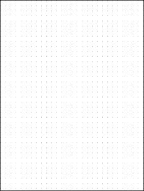
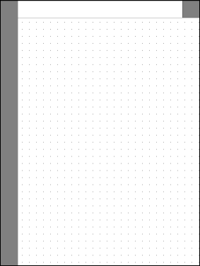
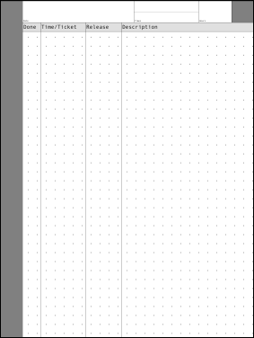

# The `make-templates` Script

This shell script uses [ImageMagick](https://imagemagick.org/)'s `magick` command to create a few `.png` templates.

* [`dots-50.png`](dots-50.png)

    

* [`basic-page.png`](basic-page.png)

    

* [`daily-work.png`](daily-work.png)

    

## License

This script is too simple to *worry* about licensing, so...

> 
>
> To the extent possible under law, John Simpson has waived all copyright and related or neighboring rights to this script or the images it produces.
>
> This work is published from the United States of America.

## Script

&#x21D2; [Download](make-templates)

```bash
#!/bin/bash
#
# make-pages
# John Simpson <jms1@jms1.net> 2023-07-02
#
# Programmatically create PNG files for use as reMarkable 2 templates

set -e

###############################################################################
#
# Create a basic page with dots every 50 pixels
#
# - Create a 50x50 canvas, filled with white.
# - Draw a 3x3 rectangle at the top left corner.
# - Save that to a "memory buffer" called 'dot'.
# - Delete the canvas.
# - Create a 1404x1872 canvas, filled with tiles of the 'dot' memory buffer.
# - Save the result as 'dots-50.png'

magick \
    -type GrayScale -depth 8 -size 50x50 'xc:white' \
    -fill black \
    -draw 'rectangle 0,0,2,2' \
    -write 'mpr:dot' \
    +delete \
    -type GrayScale -depth 8 -size 1404x1872 'tile:mpr:dot' \
    dots-50.png

###############################################################################
#
# Create what I call a "basic page".
#
# - Create a canvas from the 'dots-50.png' file created above.
# - Remove (draw a white rectangle over) 120 pixels at the top of the image.
# - Draw dark grey rectangles where the menu and "X" button appear.
# - Draw black lines between the different areas of the image.
# - Save the result as 'basic-page.png'.

magick dots-50.png \
    -fill white \
    -draw 'rectangle 0 0 1403 119' \
    \
    -fill '#808080' \
    -draw 'rectangle    0 , 0 ,  119 , 1871' \
    -draw 'rectangle 1284 , 0 , 1403 ,  119' \
    \
    -fill black \
    -draw 'line    0 ,   0 , 1403 ,    0' \
    -draw 'line  120 ,   0 ,  120 , 1871' \
    -draw 'line  120 , 120 , 1403 ,  120' \
    -draw 'line 1284 ,   0 , 1284 ,  120' \
    basic-page.png

###############################################################################
#
# Create my daily worksheet.
#
# - Create a canvas from the 'basic-page.png' file created above.
# - Draw a lighter grey rectangle where the column headings will be.
# - Draw a darker grey line across one of the boxes in the top section.
# - Draw black lines to separate the new parts of the form.
# - Add labels for the column headers.
# - Add smaller labels in the boxes across the top.
# - Save the result as 'daily-work.png'.

magick basic-page.png \
    -fill '#E0E0E0' \
    -draw 'rectangle 121 , 121 , 1403 , 169' \
    \
    -fill '#808080' \
    -draw 'line 740 , 60 , 1100 , 60' \
    \
    -fill black \
    -draw 'line  120 , 170 , 1403 ,  170' \
    -draw 'line  220 , 120 ,  220 , 1871' \
    -draw 'line  470 , 120 ,  470 , 1871' \
    -draw 'line  670 , 120 ,  670 , 1871' \
    -draw 'line  740 ,   0 ,  740 ,  120' \
    -draw 'line 1100 ,   0 , 1100 ,  120' \
    \
    -font 'Andale-Mono' \
    -pointsize 30 \
    -draw 'text 125,155 "Done"' \
    -draw 'text 225,155 "Time/Ticket"' \
    -draw 'text 475,155 "Release"' \
    -draw 'text 675,155 "Description"' \
    \
    -pointsize 12 \
    -draw 'text  125,115 "Date"' \
    -draw 'text  745,115 "Times"' \
    -draw 'text 1105,115 "Hours"' \
    \
    daily-work.png
```
